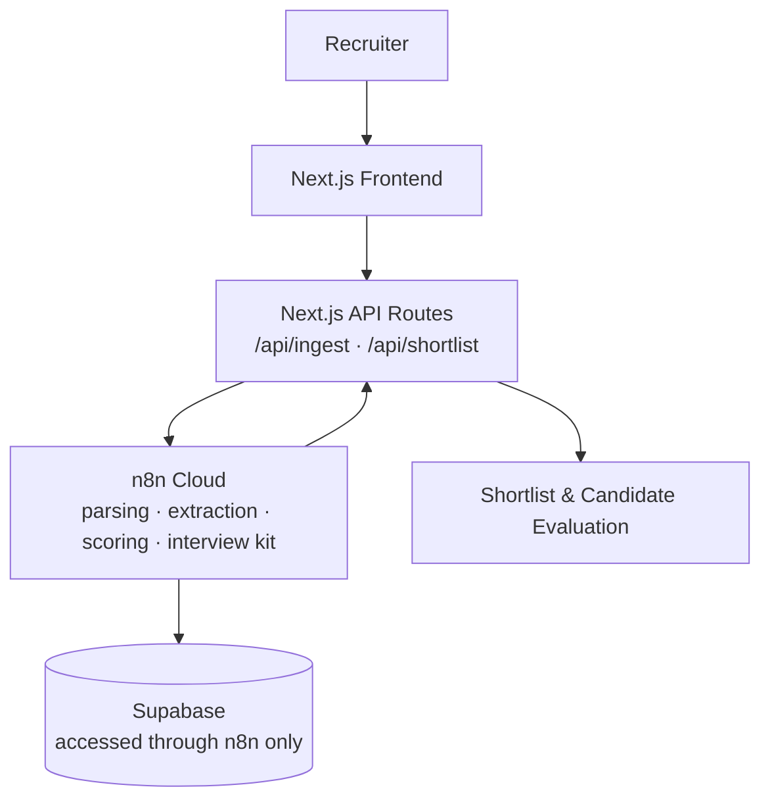

# HireFlow — AI Candidate Screening & Interview Intelligence Agent

Turn resumes into an evidence-backed shortlist and interview plan.

Recruiters spend significant time manually reviewing resumes, comparing candidates against job requirements, and preparing interviews. AI screening can help, but unexplained scores and unsupported claims make it difficult to trust. HireFlow screens resumes against a job description, ranks candidates with transparent scores, and attaches resume evidence to every important claim — while the recruiter stays the final decision maker.

---

## What it does

| Capability | How |
|---|---|
| JD + resume intake | Role title, job description, batch TXT upload with drag-and-drop |
| Structured extraction | Skills, experience, projects, education, uncertainties — each claim can carry a `source_snippet` |
| Evidence-backed scoring | Overall score, fit bucket, and justification linked to source evidence |
| Ranked shortlist | Backend-ordered candidates with score, skill match, and experience |
| Candidate evaluation | Score reasoning, evidence viewer, gaps, and interview kit per candidate |
| Interview intelligence | Candidate-specific questions (`gap_validation` / `strength_verification`) with targets and follow-ups |

**Scores are decision-support signals. Recruiters remain responsible for the final hiring decision.** HireFlow does not auto-reject or auto-hire candidates.

---

## Demo Flow

```
JD → Resume Upload → AI Processing → Ranked Shortlist → Candidate Evidence → Score & Gaps → Interview Kit
```

1. Recruiter enters a role title and job description.
2. Recruiter uploads one or more TXT resumes (processed sequentially with combined progress).
3. n8n extracts structured candidate information and maps it against the JD.
4. Each candidate receives an evidence-backed score and fit bucket (`Strong fit` / `Possible` / `Not a fit`).
5. Candidates appear in a ranked shortlist.
6. Recruiter opens a candidate evaluation and inspects source snippets behind extracted claims.
7. Recruiter reviews score justification, gaps, and uncertainties.
8. HireFlow shows candidate-specific interview questions and follow-ups.

## 📸 Product Preview

Product screenshots can be added under `docs/screenshots/`.

<!-- Intended screenshots (add the PNG files to enable them):


-->

---

## Tech Stack

- **Next.js** (App Router) + **React** + **TypeScript** + **Tailwind CSS** — frontend
- **n8n Cloud** — AI orchestration (parsing, extraction, scoring, interview-kit generation)
- **Supabase** (PostgreSQL) — candidate persistence, accessed through n8n only
- **Groq** (OpenAI-compatible LLM) — structured extraction and scoring
- **OpenCode** — development agent

## Architecture



Key principles:

- **Secrets stay server-side.** Webhook URLs live in `.env.local` (gitignored) and are read only by server routes.
- **Supabase is accessed through n8n.** The frontend never talks to the database directly.
- **AI orchestration lives in n8n.** The frontend handles presentation and interaction; it performs no parsing, scoring, or ranking.
- **Ranking is backend-authoritative.** The frontend renders shortlist order exactly as returned.

---

## Data Contracts

Concise, representative examples (full schemas in `ARCHITECTURE.md`, types in `lib/types.ts`).

**Candidate profile**

```json
{
  "candidate_id": "...",
  "skills": [{ "name": "...", "source_snippet": "..." }],
  "years_experience": 0,
  "projects": [],
  "education": [],
  "missing_or_unclear": [],
  "confidence": "..."
}
```

**Score**

```json
{
  "candidate_id": "...",
  "overall_score": 0,
  "bucket": "...",
  "skill_match_pct": 0,
  "experience_fit": "...",
  "gaps": [],
  "justification": "...",
  "justification_sources": []
}
```

**Interview kit**

```json
{
  "candidate_id": "...",
  "summary_paragraph": "...",
  "questions": [
    {
      "question": "...",
      "question_type": "gap_validation",
      "target": "...",
      "follow_ups": []
    }
  ]
}
```

> Note: the ingest endpoint returns `{ status, candidate, score, kit }`, while the shortlist endpoint returns stored rows shaped as `{ id, jd_id, profile_json, score_json, kit_json, status, created_at }`. The frontend models these as separate types.

---

## Getting Started

### Prerequisites

- Node.js 20+ and npm
- An n8n Cloud workflow exposing the ingest and shortlist webhooks
- A Supabase project wired to that workflow
- A configured LLM provider (Groq, OpenAI-compatible)

### Installation

```bash
git clone https://github.com/DivyanshuRaj7/hireflow.git
cd hireflow
npm install
```

### Environment

Copy `env.local.example` to `.env.local` and fill in the webhook URLs:

```bash
N8N_INGEST_WEBHOOK_URL=
N8N_SHORTLIST_WEBHOOK_URL=
```

These are server-side variables (no `NEXT_PUBLIC_` prefix is used anywhere in this project). **`.env.local` must never be committed** — it is gitignored.

### Development

```bash
npm run dev        # start the dev server (http://localhost:3000)
npm run build      # production build
npm run typecheck  # TypeScript check (tsc --noEmit)
```

---

## API Routes

Thin server-side forwarding routes — n8n endpoints stay out of the browser.

**POST /api/ingest** — one resume per call

```json
// request
{ "jd": "...", "jd_id": "...", "resume_text": "...", "candidate_id": "..." }

// response
{ "status": "ok | partial | error", "candidate": {}, "score": {}, "kit": {} }
```

**POST /api/shortlist** — ranked candidates for one screening

```json
// request
{ "jd_id": "..." }

// response
{ "status": "ok | partial | error", "jd_id": "...", "candidates": [] }
```

Both routes validate input (400), forward to n8n, surface upstream failures as errors rather than swallowing them, and never leak webhook URLs into responses.

---

## Design Principles

- **Evidence first.** Every important extracted claim should be traceable to resume evidence.
- **Human in the loop.** AI assists the recruiter rather than making the hiring decision.
- **Structured outputs.** AI results are converted into structured candidate, scoring, and interview data.
- **Graceful degradation.** The frontend handles `partial`/`error` responses rather than assuming every AI run is perfect.

---

## Privacy & Security

What is actually true of this prototype:

- Secrets are kept in environment variables (`.env.local`, gitignored).
- Supabase credentials live server-side in n8n, never in the frontend.
- The frontend does not directly access Supabase.
- HireFlow is a hackathon prototype. It should **not** be treated as a production HR/compliance system without additional security, privacy, bias, and compliance work.

## Limitations & Future Work

Not currently implemented (not presented as completed):

- Natural-language recruiter querying over the candidate pool
- Post-interview notes analysis
- Authentication (outside hackathon scope)
- ATS / email integrations
- Production-grade privacy and compliance review before any real hiring deployment

## Repository Structure

```
app/
  page.tsx                    # upload + batch screening
  results/page.tsx            # ranked shortlist (?jd_id=...)
  candidate/[id]/page.tsx     # candidate evaluation (?jd_id=...)
  api/
    ingest/route.ts           # thin forwarder → n8n ingest webhook
    shortlist/route.ts        # thin forwarder → n8n shortlist webhook
components/
  UploadForm.tsx              # JD + multi-TXT intake, sequential loop
  PipelineStatus.tsx          # Parsing → Extracting → Scoring → Generating
  ShortlistView.tsx           # shortlist states + summary
  ShortlistTable.tsx          # ranked table
  CandidateDetail.tsx         # evaluation composition
  CandidateSummary.tsx        # score card + summary
  AuditTrailTooltip.tsx       # verbatim evidence disclosure
  InterviewKit.tsx            # gap_validation / strength_verification
  RetryButton.tsx
lib/
  api.ts                      # server-side n8n helpers
  types.ts                    # backend contracts
```

Spec docs (`AGENTS.md`, `PRD.md`, `ARCHITECTURE.md`, `PROMPTS.md`) describe the product, backend workflows, and schemas; `env.local.example` documents the required environment variables.

## Project Highlights

HireFlow demonstrates an end-to-end AI-assisted recruiting workflow with real AI orchestration, database persistence, candidate ranking, evidence-backed evaluation, interview intelligence, and recruiter-focused UX. (See `PRD.md` for the original hackathon scope.)

## 👥 Team

Built as a hackathon project by the HireFlow team.

## License

No license has been added to this repository yet.
